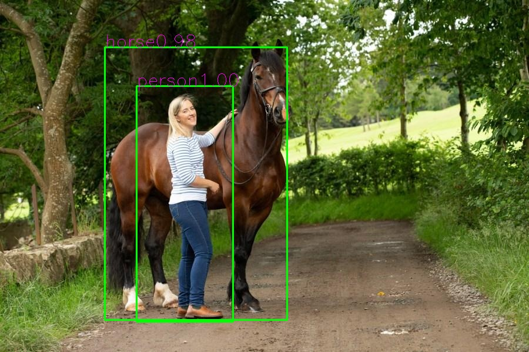
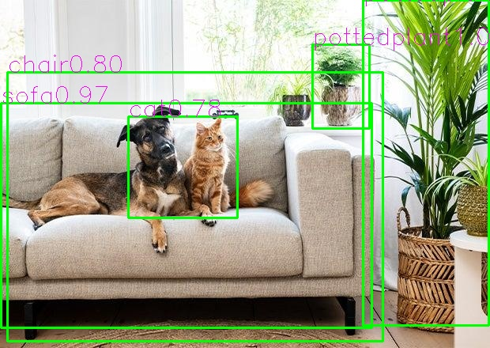
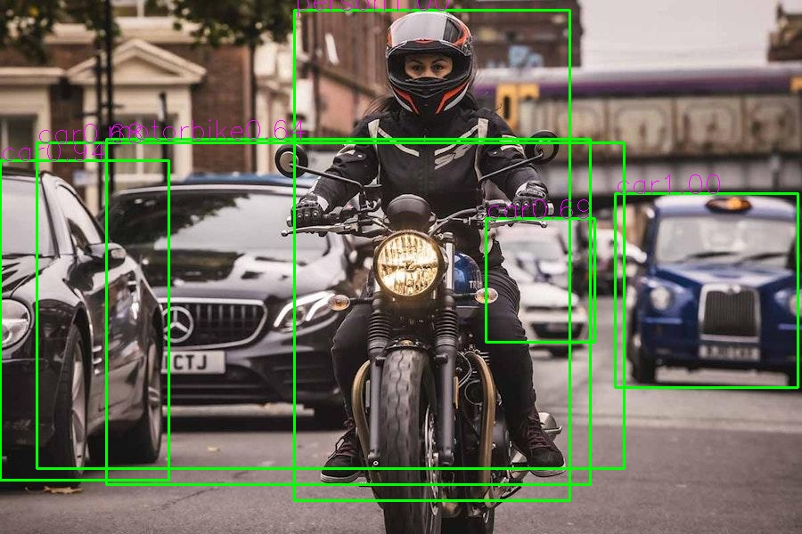

# Real-Time Object Detection

A real-time object detection system built with **Faster R-CNN** using **PyTorch and Torchvision**.

This project implements a complete object detection pipeline, including:

- Pascal VOC 2007 dataset processing
- Transfer learning with pretrained Faster R-CNN
- Custom training pipeline
- Image-based object detection
- Real-time object detection using webcam


## Demo

### Object Detection Results

<p align="center">


</p>


### Real-Time Camera Detection

<p align="center">

</p>


# Features

- Object detection with bounding boxes
- Multi-class object recognition
- Confidence score prediction
- Custom VOC dataset parser
- Transfer learning from pretrained model
- Real-time webcam inference


# Model Architecture

The project uses:

## Faster R-CNN + MobileNetV3 Large FPN


Detection pipeline:

```
Input Image
      |
      v
MobileNetV3 Backbone
      |
      v
Feature Pyramid Network (FPN)
      |
      v
Region Proposal Network (RPN)
      |
      v
ROI Heads
      |
      v
Classification + Bounding Box Regression
```


The model produces:

- Bounding boxes
- Class labels
- Confidence scores


# Dataset

The model is trained on:

**Pascal VOC 2007 Dataset**

Dataset format:

```
VOC2007
│
├── JPEGImages
│       └── image files
│
├── Annotations
│       └── XML bounding box annotations
│
└── ImageSets
        └── train/validation split
```


## Object Classes

The model detects 20 object categories:

```
aeroplane
bicycle
bird
boat
bottle
bus
car
cat
chair
cow
diningtable
dog
horse
motorbike
person
pottedplant
sheep
sofa
train
tvmonitor
```


# Data Processing

VOC XML annotations are converted into Faster R-CNN target format:

```python
{
    "boxes": FloatTensor[N,4],
    "labels": Int64Tensor[N]
}
```


Bounding box format:

```
[xmin, ymin, xmax, ymax]
```


Image preprocessing:

```
Original Image
        |
        v
Resize 416 x 416
        |
        v
Convert to Tensor
        |
        v
Normalize
        |
        v
Faster R-CNN Input
```


# Training

Run training:

```bash
python src/train.py
```


Training pipeline:

```
Dataset
   |
   v
DataLoader
   |
   v
Faster R-CNN
   |
   v
Calculate Loss
   |
   v
Backpropagation
   |
   v
Update Model Parameters
```


The training process includes:

- Transfer learning from pretrained weights
- Classification loss optimization
- Bounding box regression optimization
- Model checkpoint saving


# Image Detection

Run:

```bash
python src/deploy.py
```


Input:

```
Image file
```

Output:

```
Detected objects
Bounding boxes
Class labels
Confidence scores
```


Example:

```
person 0.95
dog    0.91
car    0.88
```


# Real-Time Camera Detection

Run:

```bash
python src/camera_detection.py
```


Pipeline:

```
Camera Frame
       |
       v
Image Preprocessing
       |
       v
Faster R-CNN Inference
       |
       v
Bounding Box Visualization
```


The system performs object detection frame-by-frame from webcam input.


# Project Structure

```
Real-Time Object Detection

│
├── src
│   │
│   ├── dataset.py
│   │       VOC dataset processing
│   │
│   ├── train.py
│   │       Model training pipeline
│   │
│   ├── deploy.py
│   │       Image inference
│   │
│   └── camera_detection.py
│           Real-time webcam detection
│
├── demo
│   │
│   ├── horse_person_result.jpg
│   ├── dog_cat_result.jpg
│   └── camera_demo.jpg
│
├── trained_models
│   │
│   ├── best_model.pt
│   └── last_model.pt
│
├── requirements.txt
│
└── README.md
```


# Technologies

| Technology | Usage |
|------------|-------|
| Python | Programming language |
| PyTorch | Deep learning framework |
| Torchvision | Faster R-CNN implementation |
| OpenCV | Image processing and camera inference |
| TensorBoard | Training monitoring |


# Installation

Clone repository:

```bash
git clone https://github.com/thanhdinh2x-hub/AI-Real-Time-Object-Detection.git
```


Install dependencies:

```bash
pip install -r requirements.txt
```


# Requirements

```
torch
torchvision
opencv-python
numpy
tqdm
torchmetrics
tensorboard
```


# Future Improvements

Possible improvements:

- Improve inference speed
- Add more training datasets
- Optimize model deployment
- Build web-based object detection application


# Author

Thanh Dinh

AI / Computer Vision Project
